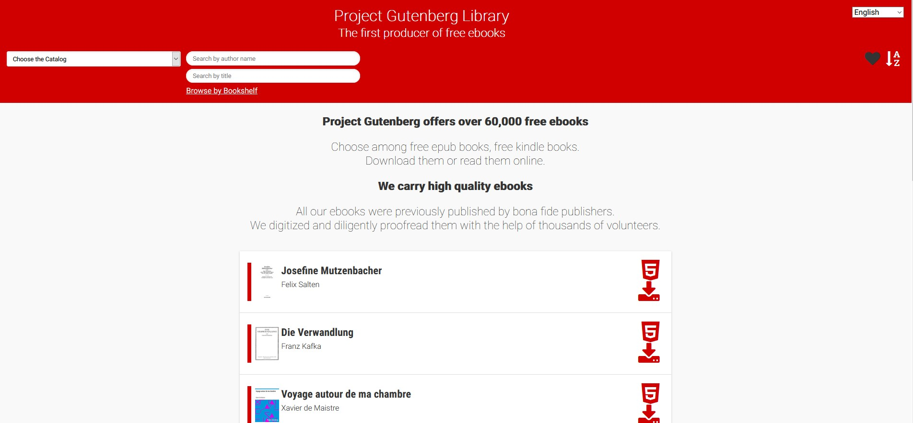

### Free Ebook Foundation Programs: Project Gutenberg ZIM

Project Gutenberg ZIM (or PGZIM) is a collaboration between the teams behind Project Gutenberg and ZIM. ZIMs provide a simple way
to build and serve archives of data statically. PGZIM is an application built to build and serve ZIMs of Project Gutenberg content to a Web browser.

## History

Project Gutenberg was founded in 1971, and his since been the leader in providing free ebooks over the Web. Eric Hellman proposed an idea to the Stevens Insitute of Technology Senior Design class of serving this content offline on a platform known as Internet in a Box.

The group working on the project that became known as "Project Gutenberg in a Box," discovered an existing platform known as Kiwix. Kiwix is an offline browser developed by Emmanuel Englehart and Renaud Gaudin in 2007, built for serving ZIM content. The Kiwix team had an ongoing project which served Project Gutenberg content over a ZIM, so the Project Gutenberg in a Box team decided to contribute this project instead of pursuing their own.

## Contributions

The team working on PGZIM was able to make numerous contributions to the Kiwix version of Project Gutenberg.

- A filter for searching for books by title.
- Integration between the platform and Project Gutenberg bookshelves.
- A filter for searching for books by bookshelf.
- A filter for finding bookshelves by their name.
- Improved styling throughout the application, including enhanced mobile support.
- All contributions are fully translatable across the languages that PGZIM supports.

## Learn More

See PGZIM hosted online by visiting [the demo site](http://pgzim.ebookfoundation.org/kiwix/gutenberg_de-fr_all_2020-04/A/Home.html), hosting German and French ebooks.
